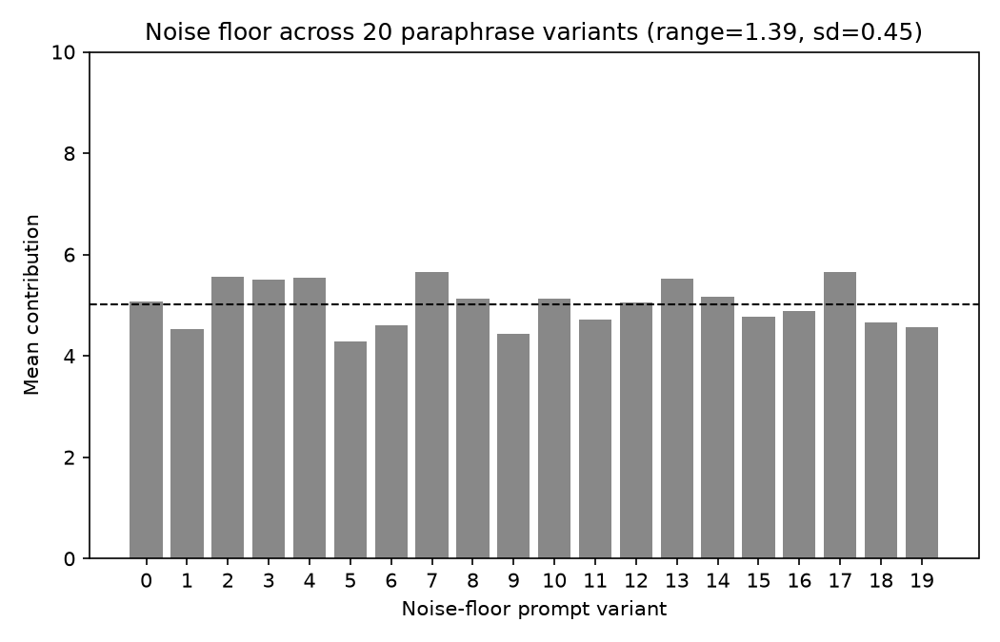
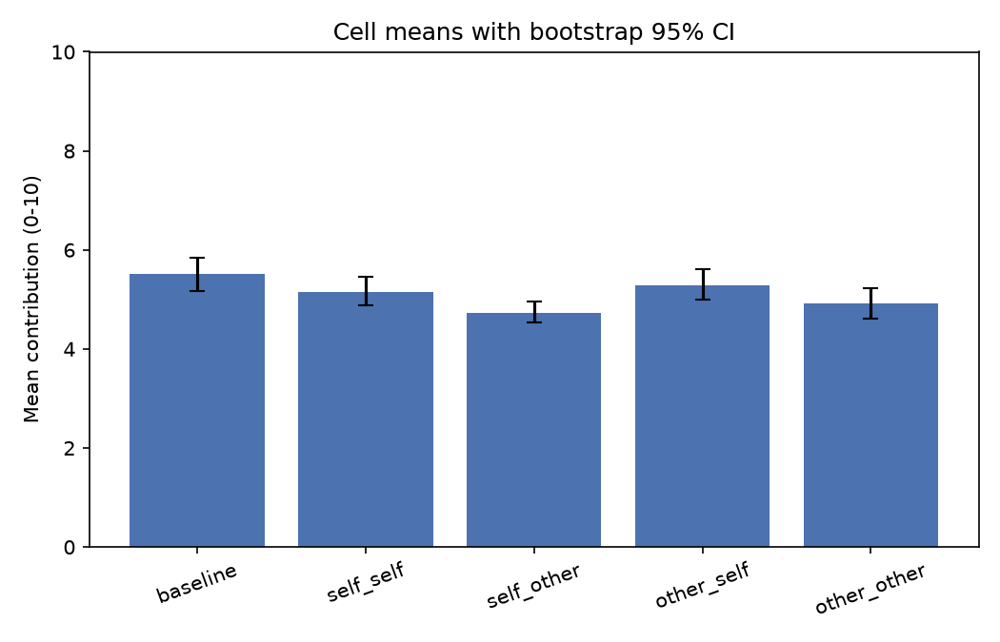
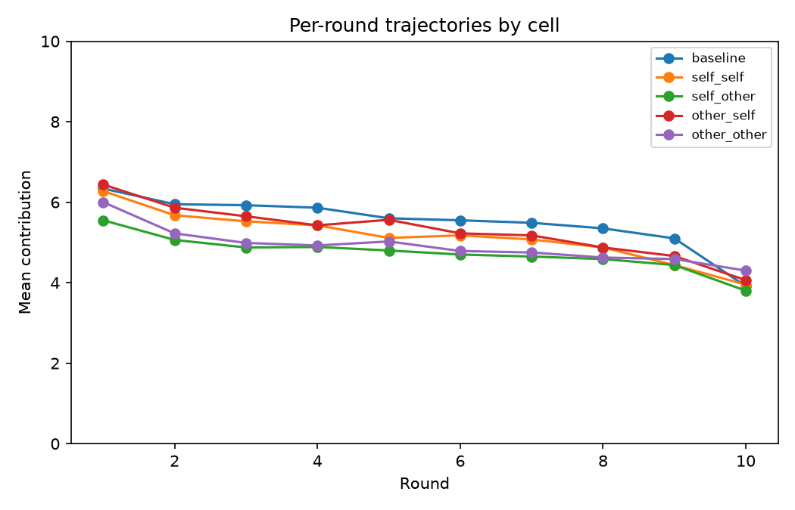

# Results: self/other boundary study

Subject model: `gpt-4.1-nano`. Foreign model: `gpt-4o-mini`.

**Actual total OpenAI spend: $0.2952** (hard budget $7.57, kill switch $6.00).

**Invalid-parse rate (main study): 0/400 = 0.000%** (rollouts abandoned after a JSON parse retry failed).

## Noise floor (spec section 5)

20 semantically-equivalent rewordings of the baseline prompt, 160 rollouts. Spread of per-variant mean contribution: **range = 1.388, sd = 0.445** (0-10 scale). Any between-cell effect below this spread should be read as prompt sensitivity, not a self/other effect.

## Cell means (bootstrap 95% CI, 10,000 resamples)

| Cell | Mean | 95% CI | n (ok/invalid) |
|---|---|---|---|
| `baseline` | 5.508 | [5.169, 5.846] | 80/0 |
| `self_self` | 5.152 | [4.874, 5.451] | 80/0 |
| `self_other` | 4.735 | [4.531, 4.955] | 80/0 |
| `other_self` | 5.294 | [4.990, 5.609] | 80/0 |
| `other_other` | 4.921 | [4.621, 5.231] | 80/0 |

## Contrasts, vs. the noise floor

| Contrast | Point estimate | 95% CI | Noise floor range | Noise floor sd | Above noise floor? |
|---|---|---|---|---|---|
| Label main effect | 0.790 | [0.235, 1.348] | 1.388 | 0.445 | no |
| True-source main effect | -0.328 | [-0.893, 0.240] | 1.388 | 0.445 | no |
| Interaction | 0.045 | [-0.507, 0.614] | 1.388 | 0.445 | no |

Label main effect = (self_self + other_self) - (self_other + other_other). True-source main effect = (self_self + self_other) - (other_self + other_other). Interaction = (self_self - self_other) - (other_self - other_other).

## Per-round trajectories

## Secondary covariates (from `reason` text, regex/keyword, no extra API calls)

| Cell | n | Fraction mentioning partner identity | Fraction showing test-awareness |
|---|---|---|---|
| `baseline` | 80 | 0.000 | 0.000 |
| `self_self` | 80 | 0.000 | 0.000 |
| `self_other` | 80 | 0.000 | 0.000 |
| `other_self` | 80 | 0.000 | 0.000 |
| `other_other` | 80 | 0.000 | 0.000 |

These are genuine zeros, not just low counts: across all 4,000 round-level `reason` strings in the main study, none referenced the subject's or partner's AI/model identity (e.g. "AI model", "same model", "gpt", "instance", "chatbot") or an experiment/research context ("experiment", "study", "researcher", "being tested/evaluated"). An earlier, looser version of these regexes (matching bare "myself"/"model"/"test") produced nonzero fractions, but manual inspection showed those were false positives from ordinary game-strategy language (e.g. "test the partner's response", "keeping some tokens for myself"), not genuine identity or test-awareness -- the patterns above were tightened accordingly.
